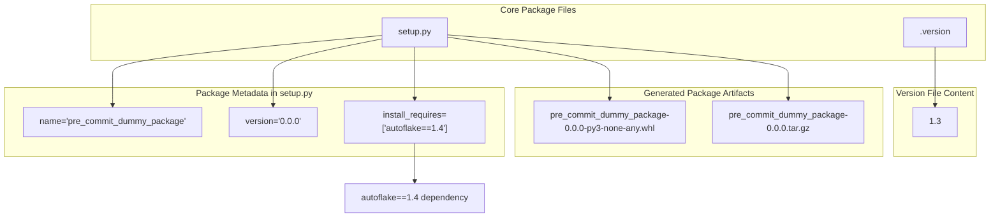
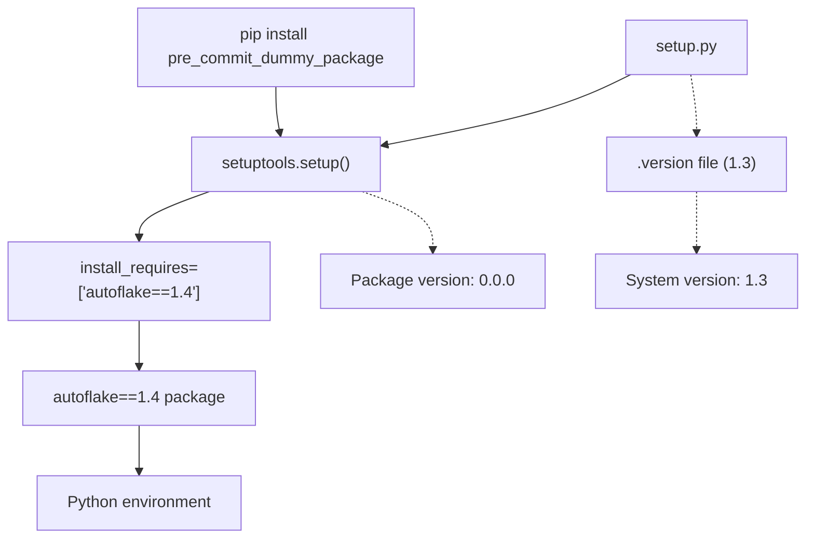
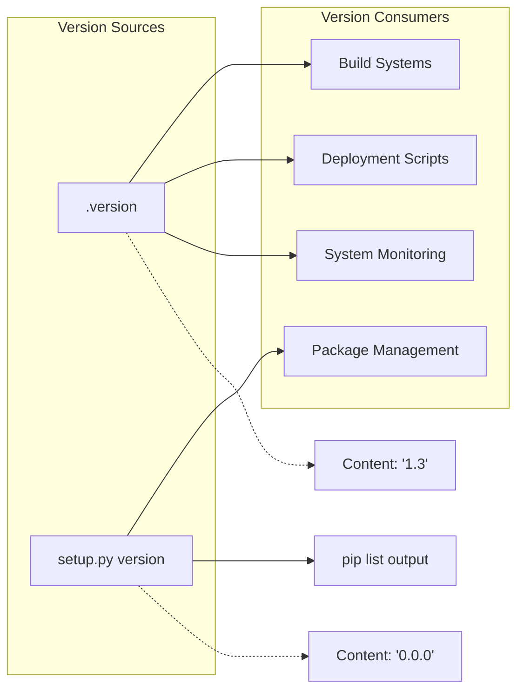
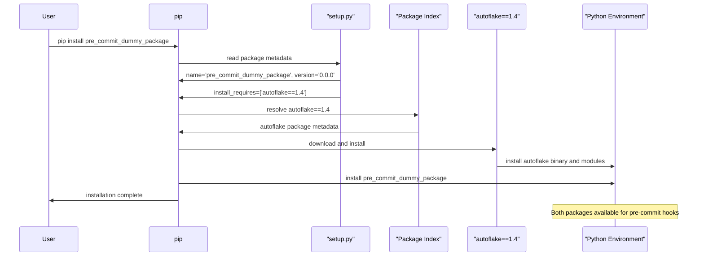

# Core Package System

Relevant source files

The following files were used as context for generating this wiki page:

- [.version](.version)
- [setup.py](setup.py)

## Purpose and Scope

The Core Package System comprises the fundamental components that define the `pre_commit_dummy_package` as a Python package and manage its versioning. This system consists of two primary files: `setup.py` for package configuration and dependency management, and `.version` for system-wide version tracking.

This document covers the package definition, metadata, dependency specification, and version management architecture. For information about pre-commit hook configurations that leverage this package, see [Pre-commit Hook Integration](#3). For practical installation and usage instructions, see [Installation and Usage](#4).

## Package Definition Architecture

The core package system establishes the `pre_commit_dummy_package` as a minimal wrapper package that ensures `autoflake==1.4` is available in pre-commit environments.

### Package Structure Diagram

Sources: [setup.py:1-9](), [.version:1-2]()

## Setup.py Configuration

The [setup.py:1-9]() file defines the minimal package configuration using `setuptools`. The package serves as a dependency vehicle rather than providing direct functionality.

### Package Metadata

| Property | Value | Purpose |
|----------|-------|---------|
| `name` | `pre_commit_dummy_package` | Identifies the package in PyPI and pip installations |
| `version` | `0.0.0` | Package version for distribution |
| `install_requires` | `['autoflake==1.4']` | Ensures autoflake 1.4 is installed with the package |

The setup function call at [setup.py:4-8]() uses keyword arguments to define package metadata. The `install_requires` parameter specifies the exact version `autoflake==1.4`, ensuring compatibility and predictable behavior.

### Dependency Management Flow

Sources: [setup.py:4-8]()

## Version Management System

The version management system uses a dual-version approach with separate tracking for package distribution and system versioning.

### Version File Structure

The [.version:1]() file contains a single line with the version string `1.3`. This file serves as the authoritative source for system-wide version identification, separate from the package's distribution version.

### Version Discrepancy Analysis

| File | Version | Purpose |
|------|---------|---------|
| `.version` | `1.3` | System/repository version tracking |
| `setup.py` | `0.0.0` | Package distribution version |

This dual-version system indicates that:
- The `.version` file tracks the overall system maturity and release cycle
- The `setup.py` version remains at `0.0.0`, suggesting this is a development or utility package not intended for production versioning
- The package serves as a dependency wrapper rather than a standalone application

### Version Integration Points

Sources: [.version:1](), [setup.py:6]()

## Package Installation Flow

The core package system enables the following installation and dependency resolution process:

### Installation Sequence

Sources: [setup.py:5-7]()

## System Integration

The core package system integrates with the broader pre-commit infrastructure by ensuring `autoflake` availability and providing package metadata for dependency management.

### Integration Architecture

The `pre_commit_dummy_package` serves as a bridge between pre-commit framework requirements and the `autoflake` tool, ensuring version compatibility and installation consistency across different environments.

Sources: [setup.py:1-9](), [.version:1-2]()
