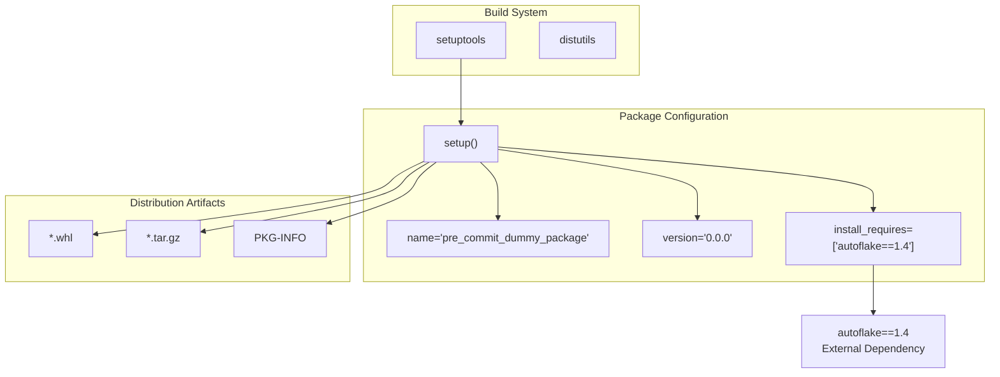
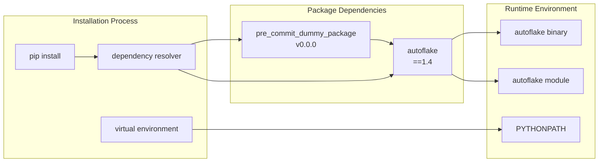
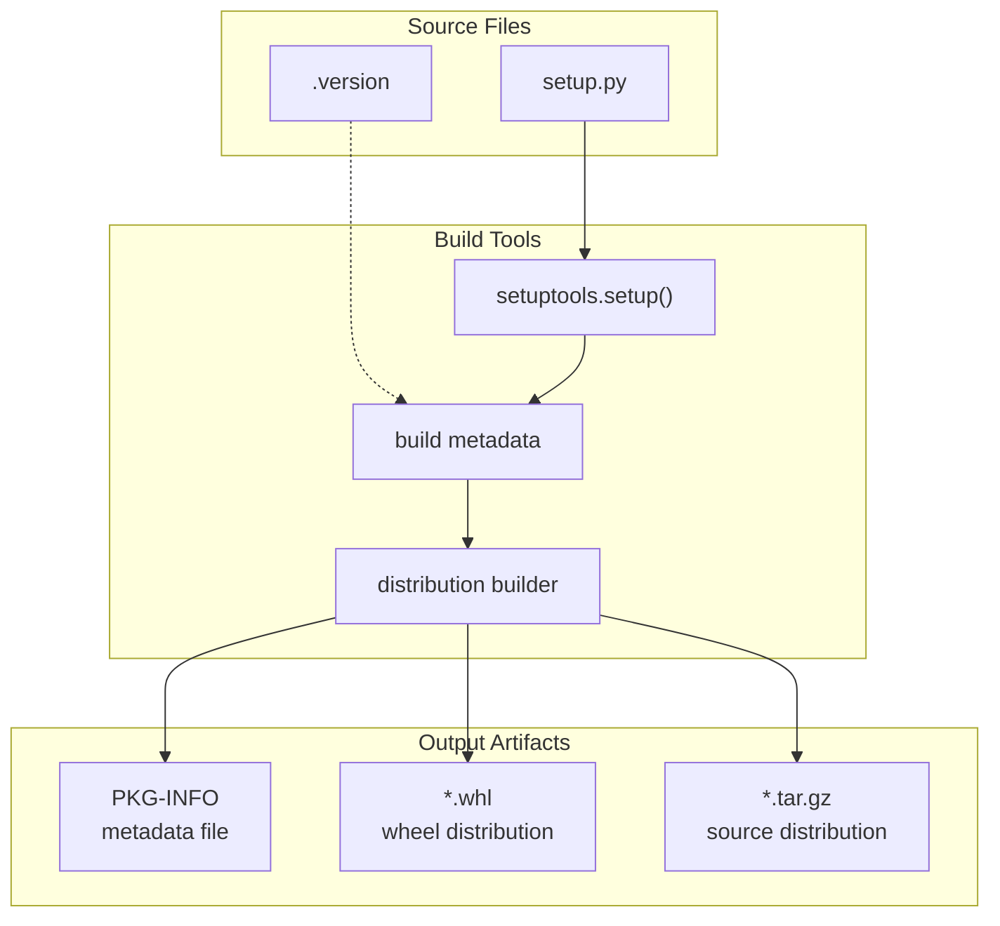

# Package Configuration

Relevant source files

The following files were used as context for generating this wiki page:

- [setup.py](setup.py)

This document covers the core package definition and configuration for `pre_commit_dummy_package`, focusing on the `setup.py` file that defines package metadata, dependencies, and build configuration. This page documents the technical implementation details of how the package is structured and configured for distribution.

For information about version tracking and management, see [Version Management](#2.2). For details about how this package integrates with pre-commit hooks, see [Pre-commit Hook Integration](#3).

## Package Definition Structure

The package configuration follows a minimal setuptools-based approach, defined entirely within `setup.py`. The configuration establishes this repository as a Python package that serves as a dependency bridge to `autoflake`.

### Setup Configuration Diagram

Sources: [setup.py:1-8]()

## Package Metadata

The package metadata is defined through the `setuptools.setup()` function call with minimal required parameters.

### Core Metadata Fields

| Field | Value | Purpose |
|-------|-------|---------|
| `name` | `'pre_commit_dummy_package'` | Package identifier for PyPI and pip |
| `version` | `'0.0.0'` | Package version for distribution |
| `install_requires` | `['autoflake==1.4']` | Runtime dependencies specification |

The package name `pre_commit_dummy_package` indicates this serves as a wrapper or integration package rather than providing direct functionality. The version `0.0.0` suggests this is either a development package or intentionally maintains a static version since the actual functionality comes from the pinned `autoflake` dependency.

Sources: [setup.py:5-7]()

## Dependency Configuration

The package defines a single runtime dependency with strict version pinning.

### Dependency Architecture

Sources: [setup.py:7]()

### Strict Version Pinning

The dependency specification `autoflake==1.4` uses exact version matching (`==`) rather than compatible release (`~=`) or minimum version (`>=`) constraints. This approach ensures:

- **Reproducible Builds**: Identical dependency versions across all installations
- **Compatibility Guarantee**: Package tested specifically with `autoflake` version 1.4
- **Stability**: Prevents automatic updates that might introduce breaking changes

The pinned version suggests this package was developed and tested against a specific version of `autoflake` and maintains that constraint to ensure reliable operation.

Sources: [setup.py:7]()

## Build System Integration

The package uses the standard `setuptools` build system with minimal configuration.

### Build Process Flow

Sources: [setup.py:1-8]()

## Missing Configuration Elements

The `setup.py` configuration is deliberately minimal, omitting several standard package metadata fields:

- **No author information**: `author`, `author_email` fields absent
- **No description**: `description`, `long_description` fields not specified  
- **No classifiers**: PyPI classifier metadata not included
- **No entry points**: No console scripts or entry points defined
- **No package discovery**: No `packages` or `py_modules` specified

This minimal approach aligns with the package's role as a dependency bridge rather than a standalone application or library.

Sources: [setup.py:4-8]()

## Configuration Validation

The `setup.py` file follows the basic requirements for a valid Python package:

1. **Import Statement**: Correctly imports `setup` from `setuptools` [setup.py:1]()
2. **Function Call**: Proper `setup()` function invocation [setup.py:4]()
3. **Required Fields**: Includes mandatory `name` and `version` parameters [setup.py:5-6]()
4. **Dependency Format**: Uses valid requirement specification format [setup.py:7]()

The configuration will successfully build distributable packages despite its minimal nature, as `setuptools` provides sensible defaults for omitted fields.

Sources: [setup.py:1-8]()
