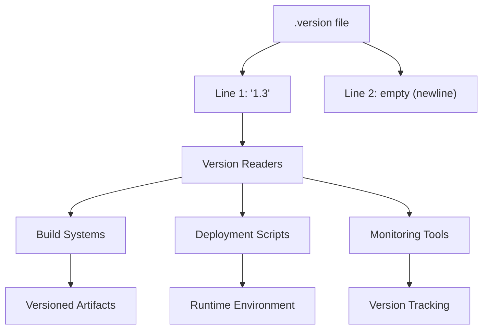
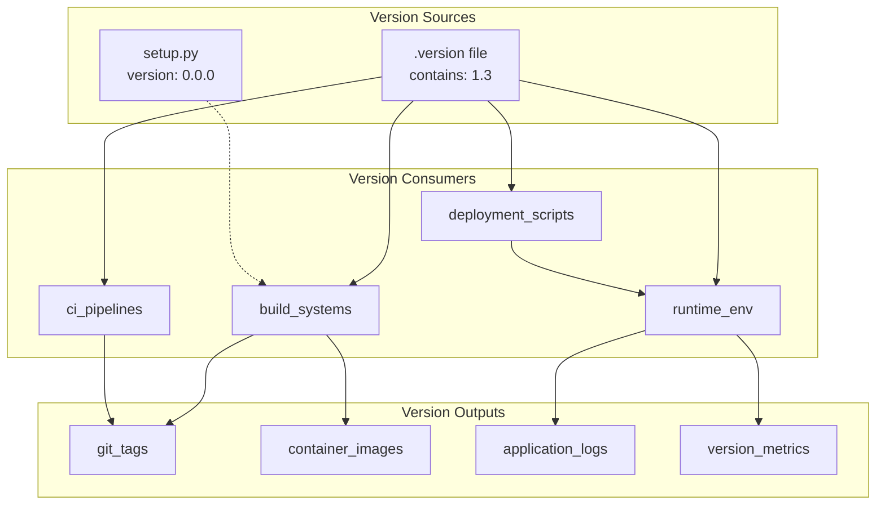
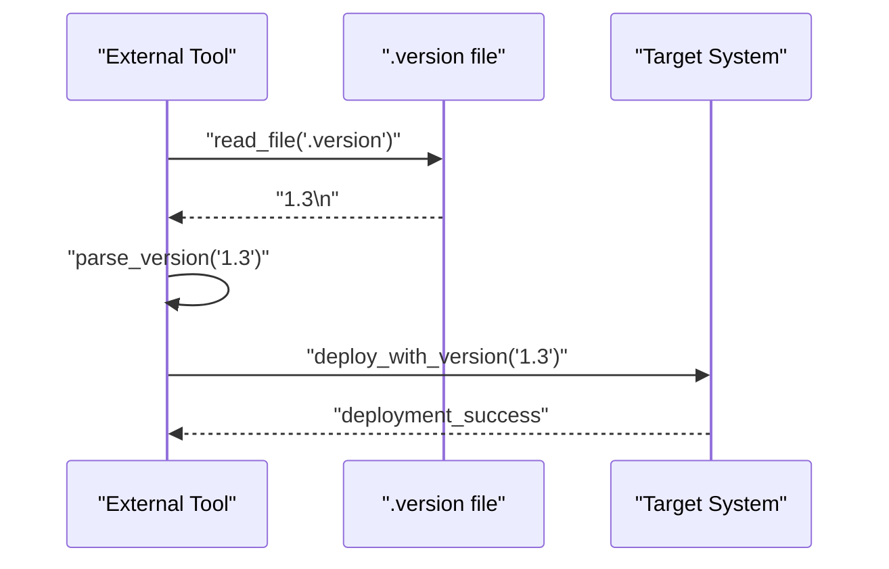

# Version Management

<details>
<summary>Relevant source files</summary>

The following files were used as context for generating this wiki page:

- [.version](.version)

</details>


## Purpose and Scope

This document covers the version management system used by the pre_commit_dummy_package repository, specifically focusing on the `.version` file and its role in tracking system releases and deployments. This system operates independently from the package versioning defined in `setup.py` (covered in [Package Configuration](#2.1)).

The version management system provides a centralized mechanism for tracking the overall repository version, which differs from the internal package version used for distribution purposes.

## Version File Structure

The version management system centers around a single file that maintains the current system version.

### Version File Format

The `.version` file uses a simple plain text format containing only the version number:

| Component | Value | Location |
|-----------|--------|----------|
| Version Number | `1.3` | [.version:1]() |
| Terminating Newline | Present | [.version:2]() |

The file follows a minimal structure with the version string on the first line and a trailing newline character. This format ensures compatibility with automated version reading tools and scripts.

**Version File Structure Diagram**


Sources: [.version:1-2]()

## Version Tracking Architecture

The version management system operates as a standalone tracking mechanism within the repository structure.

### Version Storage and Access

**Version Management Flow Diagram**


The `.version` file serves as the authoritative source for system versioning, while `setup.py` maintains a separate package version for distribution purposes. This dual-versioning approach allows independent tracking of repository releases versus package distributions.

Sources: [.version:1]()

## Version Management Patterns

### Current Version State

The system currently maintains version `1.3` as specified in the version file. This version number follows semantic versioning conventions where:

- Major version: `1` - Indicates the primary system version
- Minor version: `3` - Represents incremental updates or features

| Version Component | Current Value | Purpose |
|-------------------|---------------|---------|
| Major Version | `1` | System compatibility level |
| Minor Version | `3` | Feature/update increment |
| Full Version | `1.3` | Complete version identifier |

### Version Access Patterns

Systems and tools can access the version information through direct file reading:

```
# Version file access pattern
read_version_from_file(".version") -> "1.3"
```

This simple access pattern enables integration with various build tools, deployment systems, and monitoring solutions that need to track the current system version.

**Version Access Integration Diagram**


Sources: [.version:1-2]()

## Integration with Build Systems

The version management system integrates with build and deployment workflows through standardized file access patterns. Build systems can programmatically read the version file to tag releases, generate deployment artifacts, and maintain version consistency across environments.

The separation between system version (`.version`) and package version (`setup.py`) enables flexible release management where the overall system can be versioned independently from the Python package distribution cycle.

Sources: [.version:1]()
