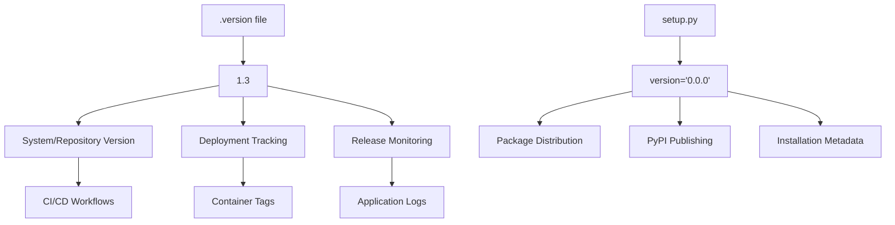
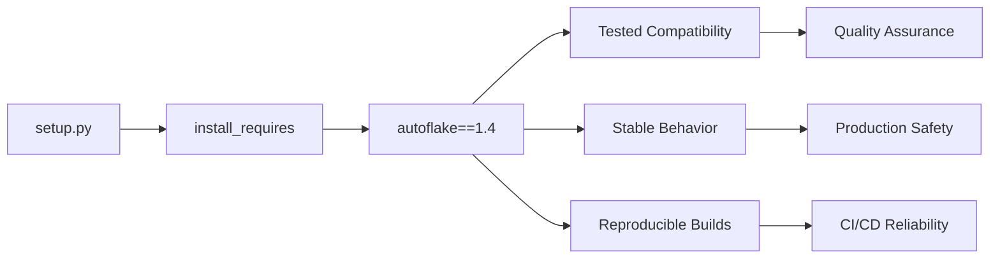
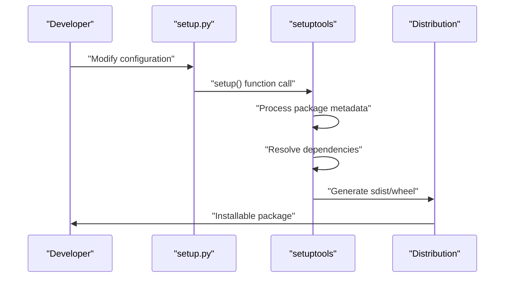

# Development and Maintenance

<details>
<summary>Relevant source files</summary>

The following files were used as context for generating this wiki page:

- [.version](.version)
- [setup.py](setup.py)

</details>


This document covers the development workflow, maintenance procedures, and release management for the `pre_commit_dummy_package`. It provides guidance for contributors and maintainers on version management, dependency updates, and package distribution processes.

For installation and usage information, see [Installation and Usage](#4). For details about the package configuration structure, see [Package Configuration](#2.1).

## Version Management Strategy

The repository implements a dual version management approach with distinct purposes for different versioning contexts.

### Version File System

The `.version` file serves as the primary version identifier for the overall system and repository state, while `setup.py` maintains a separate package version for distribution purposes.



**Version Management Workflow**
Sources: [.version:1-1](), [setup.py:6-6]()

### Updating System Version

To update the repository version, modify the `.version` file:

| Action | File | Content |
|--------|------|---------|
| Current version | `.version` | `1.3` |
| Version update | `.version` | New version number |
| Package version | `setup.py` | Remains `0.0.0` |

The `setup.py` version typically remains at `0.0.0` as this package serves as an integration wrapper rather than a standalone distributable package.

Sources: [.version:1-1](), [setup.py:6-6]()

## Dependency Management

### Autoflake Version Pinning

The package maintains a strict dependency on `autoflake==1.4` to ensure compatibility and predictable behavior across installations.



**Dependency Update Process**
Sources: [setup.py:7-7]()

### Updating Autoflake Dependency

When updating the autoflake dependency version:

1. **Test Compatibility**: Verify the new autoflake version works with existing hook configurations
2. **Update setup.py**: Modify the version specification in `install_requires`
3. **Validate Integration**: Test pre-commit hook execution with the new dependency
4. **Update Documentation**: Ensure any version-specific behavior is documented

```python
# Current dependency specification
install_requires=['autoflake==1.4']

# Example update process
install_requires=['autoflake==1.5']  # Update version
```

Sources: [setup.py:7-7]()

## Package Maintenance Procedures

### Build and Distribution Workflow

The package uses `setuptools` for build and distribution management through the `setup.py` configuration.



**Package Build Components**
Sources: [setup.py:1-8]()

### Core Package Configuration

The `setup.py` file defines the minimal package structure required for pre-commit integration:

| Configuration | Value | Purpose |
|---------------|-------|---------|
| `name` | `'pre_commit_dummy_package'` | Package identifier |
| `version` | `'0.0.0'` | Distribution version |
| `install_requires` | `['autoflake==1.4']` | Runtime dependency |

Sources: [setup.py:5-7]()

### Release Process

#### Pre-release Checklist

1. **Version Verification**: Ensure `.version` reflects the correct system version
2. **Dependency Testing**: Validate autoflake integration functionality
3. **Hook Configuration**: Verify pre-commit hook definitions remain valid
4. **Build Testing**: Confirm package builds successfully with current dependencies

#### Release Execution

1. **Update System Version**: Modify [.version:1-1]() as needed
2. **Package Validation**: Run `python setup.py check` to validate configuration
3. **Distribution Build**: Generate source and wheel distributions
4. **Integration Testing**: Test installation and hook execution in clean environment

Sources: [.version:1-1](), [setup.py:4-8]()

## Development Environment Setup

### Local Development Configuration

For local development and testing of package modifications:

```bash
# Install in development mode
pip install -e .

# Verify dependency installation
pip list | grep autoflake

# Test package import
python -c "import pkg_resources; print(pkg_resources.get_distribution('pre_commit_dummy_package'))"
```

### Testing Package Changes

When modifying the package configuration:

1. **Dependency Resolution**: Verify `install_requires` specifications resolve correctly
2. **Import Testing**: Ensure the package installs without import errors
3. **Integration Validation**: Test with actual pre-commit configurations
4. **Cross-environment Testing**: Validate across different Python versions if supported

Sources: [setup.py:7-7]()

## Monitoring and Troubleshooting

### Common Maintenance Issues

| Issue | Symptoms | Resolution |
|-------|----------|------------|
| Dependency conflicts | Installation failures | Update autoflake version specification |
| Version mismatches | Inconsistent versioning | Align `.version` with release strategy |
| Build failures | `setup.py` errors | Validate package metadata and dependencies |

### Package Health Monitoring

Monitor these indicators for package health:

- **Dependency Resolution**: Ensure `autoflake==1.4` remains available and compatible
- **Installation Success**: Track installation failure rates across environments
- **Integration Functionality**: Monitor pre-commit hook execution success

Sources: [setup.py:5-8](), [.version:1-1]()
