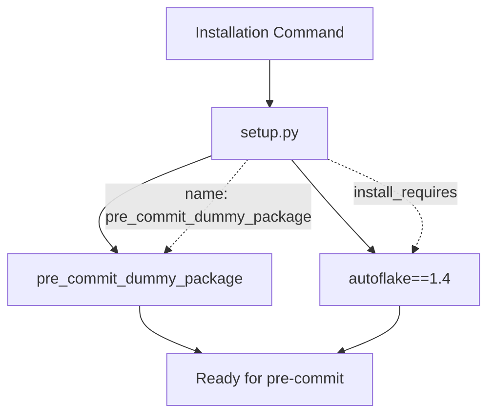
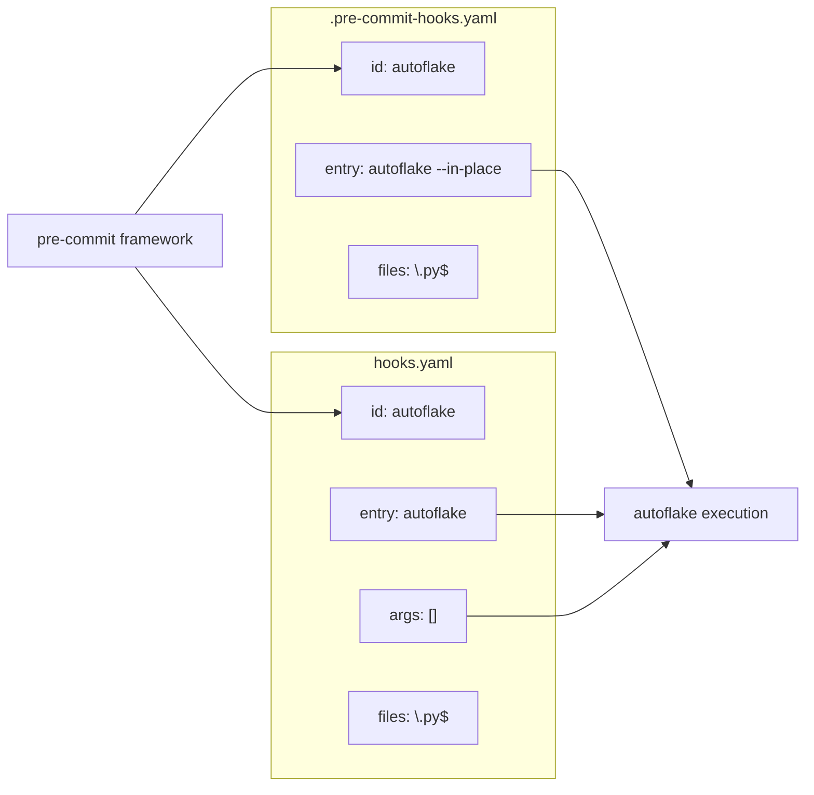
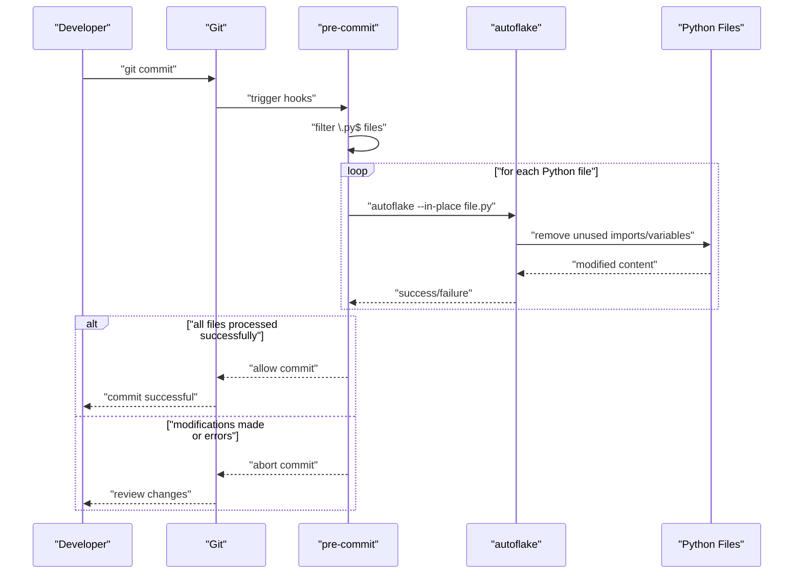

# Installation and Usage

<details>
<summary>Relevant source files</summary>

The following files were used as context for generating this wiki page:

- [.pre-commit-hooks.yaml](.pre-commit-hooks.yaml)
- [hooks.yaml](hooks.yaml)
- [setup.py](setup.py)

</details>


This page provides practical guidance for installing the `pre_commit_dummy_package` and integrating it into development workflows. The package serves as a pre-commit hook wrapper for the `autoflake` tool, enabling automatic removal of unused imports and variables during Git commits.

For detailed information about the package configuration and dependencies, see [Package Configuration](#2.1). For comprehensive hook configuration details, see [Pre-commit Hook Integration](#3).

## Installation Methods

The `pre_commit_dummy_package` can be installed using standard Python package management tools. The package automatically handles the `autoflake` dependency through its setup configuration.

### Direct Installation

```bash
pip install pre_commit_dummy_package
```

The [setup.py:7]() configuration ensures that `autoflake==1.4` is automatically installed as a dependency during package installation.

### Installation in Virtual Environment

```bash
python -m venv autoflake-env
source autoflake-env/bin/activate  # On Windows: autoflake-env\Scripts\activate
pip install pre_commit_dummy_package
```

## Installation Flow Diagram



Sources: [setup.py:4-8]()

## Pre-commit Configuration

### Standard Configuration

To use the package with pre-commit, add it to your `.pre-commit-config.yaml` file:

```yaml
repos:
  - repo: https://github.com/Meesho/mirrors-autoflake
    rev: v1.3  # Use the ref you want to point at
    hooks:
      - id: autoflake
```

The hook configuration in [.pre-commit-hooks.yaml:1-5]() defines the `autoflake` hook with the following properties:

| Property | Value | Description |
|----------|-------|-------------|
| `id` | `autoflake` | Hook identifier |
| `name` | `autoflake` | Display name |
| `entry` | `autoflake --in-place` | Command executed |
| `language` | `python` | Runtime environment |
| `files` | `\.py$` | File pattern to match |

### Alternative Configuration

An alternative hook configuration is available in [hooks.yaml:1-7]() that provides different default arguments:

```yaml
repos:
  - repo: https://github.com/Meesho/mirrors-autoflake
    rev: v1.3
    hooks:
      - id: autoflake
        args: ['--remove-all-unused-imports', '--ignore-init-module-imports']
```

The main difference is that [hooks.yaml:3]() uses `autoflake` without the `--in-place` flag, allowing for more flexible argument customization.

## Hook Configuration Comparison



Sources: [.pre-commit-hooks.yaml:1-5](), [hooks.yaml:1-7]()

## Usage Scenarios

### Basic Usage

Once configured, the hook runs automatically on Git commits:

```bash
git add modified_file.py
git commit -m "Update Python file"
# autoflake runs automatically, removing unused imports
```

### Manual Execution

Run the hook manually on all applicable files:

```bash
pre-commit run autoflake --all-files
```

### Custom Arguments

Override default arguments by specifying them in your pre-commit configuration:

```yaml
- id: autoflake
  args: ['--remove-all-unused-imports', '--ignore-init-module-imports', '--remove-unused-variables']
```

## Execution Workflow



Sources: [.pre-commit-hooks.yaml:3-5]()

## Verification and Troubleshooting

### Verify Installation

Check that both the package and its dependency are installed:

```bash
pip list | grep -E "(pre-commit-dummy-package|autoflake)"
```

### Verify Hook Configuration

List available hooks:

```bash
pre-commit run --help
```

The `autoflake` hook should appear in the available hooks list.

### Common Issues

| Issue | Cause | Solution |
|-------|-------|----------|
| Hook not found | Package not installed | Run `pip install pre_commit_dummy_package` |
| Wrong autoflake version | Dependency conflict | Ensure `autoflake==1.4` is installed |
| Hook skipped | No Python files changed | Normal behavior, hook only runs on `.py` files |

### Debug Hook Execution

Run hook with verbose output:

```bash
pre-commit run autoflake --verbose --all-files
```

Sources: [setup.py:7](), [.pre-commit-hooks.yaml:5]()
