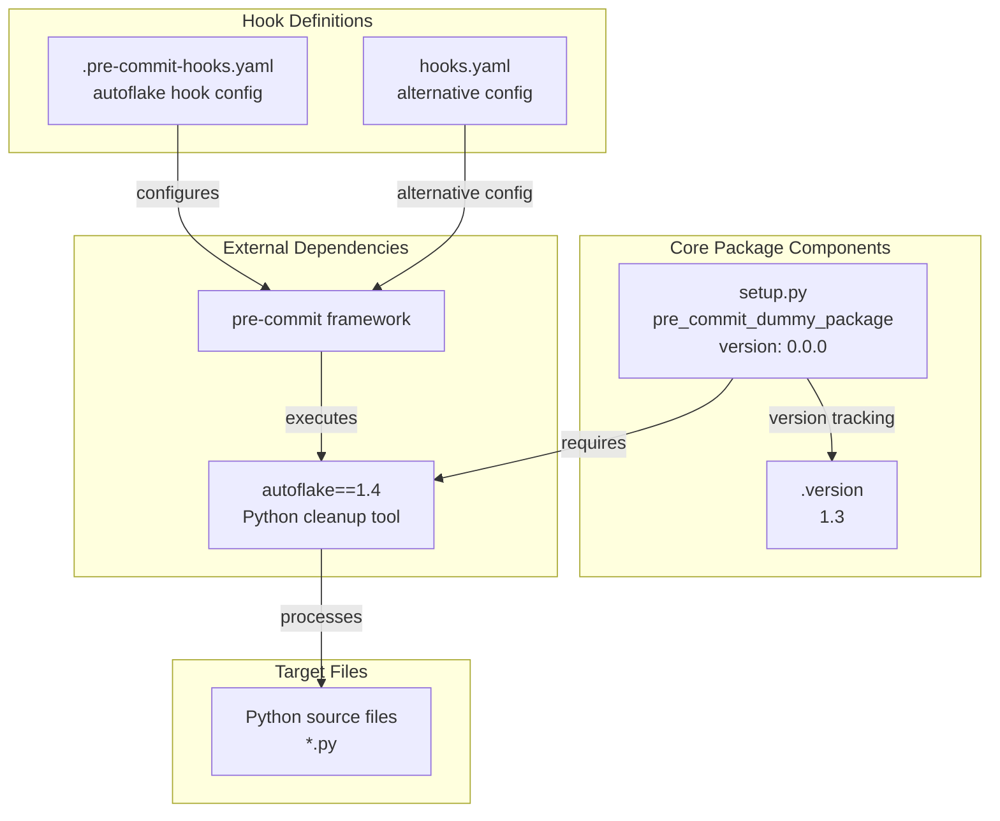
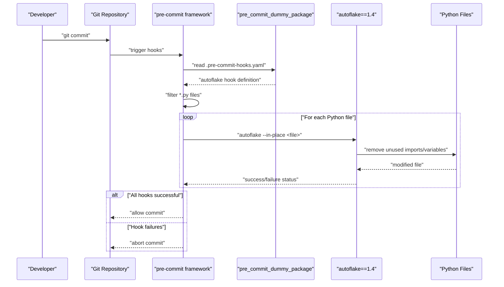

# Overview

Relevant source files

The following files were used as context for generating this wiki page:

- [.pre-commit-hooks.yaml](.pre-commit-hooks.yaml)
- [.version](.version)
- [hooks.yaml](hooks.yaml)
- [setup.py](setup.py)

## Purpose and Scope

This document provides a high-level overview of the `pre_commit_dummy_package` repository, which serves as a pre-commit framework integration wrapper for the `autoflake` Python code cleanup tool. The repository implements a minimal packaging structure that enables `autoflake` to be used as a pre-commit hook in Python development workflows.

This overview covers the system architecture, core components, and integration patterns. For detailed package configuration information, see [Package Configuration](#2.1). For comprehensive pre-commit hook setup details, see [Standard Hook Configuration](#3.1) and [Alternative Hook Configuration](#3.2).

Sources: [setup.py:1-9](), [.pre-commit-hooks.yaml:1-6](), [hooks.yaml:1-8]()

## System Architecture

The repository implements a wrapper architecture that bridges the pre-commit framework with the `autoflake` tool through a minimal Python package.

**System Architecture Overview**

Sources: [setup.py:4-8](), [.version:1](), [.pre-commit-hooks.yaml:1-6](), [hooks.yaml:1-7]()

## Package Structure and Components

The repository follows a minimal structure focused on integration rather than standalone functionality. The core components serve distinct roles in the pre-commit integration workflow.

| Component | File | Primary Function | Version/Config |
|-----------|------|------------------|----------------|
| Package Definition | `setup.py` | Defines `pre_commit_dummy_package` and dependencies | `version='0.0.0'` |
| Version Tracking | `.version` | System version management | `1.3` |
| Standard Hook Config | `.pre-commit-hooks.yaml` | Official pre-commit hook definition | autoflake with `--in-place` |
| Alternative Hook Config | `hooks.yaml` | Alternative hook configuration | autoflake without `--in-place` |

Sources: [setup.py:5-7](), [.version:1](), [.pre-commit-hooks.yaml:1-5](), [hooks.yaml:1-6]()

## Integration Workflow

The system operates within the pre-commit framework execution cycle, providing autoflake functionality through hook definitions.

**Pre-commit Integration Workflow**

Sources: [.pre-commit-hooks.yaml:1-5](), [setup.py:7]()

## Key Components Summary

### Package Identity and Dependencies

The `setup.py` file defines the core package identity as `pre_commit_dummy_package` with a fixed version of `0.0.0` and establishes a strict dependency on `autoflake==1.4`. This design ensures consistent autoflake behavior across different environments.

Sources: [setup.py:4-8]()

### Version Management Strategy

The repository implements a dual-version strategy where the `.version` file tracks system version `1.3` while the package version remains at `0.0.0`. This pattern suggests the `.version` file serves repository-level versioning while the package maintains a separate lifecycle.

Sources: [.version:1](), [setup.py:6]()

### Hook Configuration Options

Two hook configuration files provide different autoflake execution modes:
- `.pre-commit-hooks.yaml`: Standard configuration with `autoflake --in-place` for automatic file modification
- `hooks.yaml`: Alternative configuration with basic `autoflake` entry and configurable `args` array

Sources: [.pre-commit-hooks.yaml:3](), [hooks.yaml:3,6]()

### Integration Points

The system integrates with external tools through well-defined interfaces:
- **pre-commit framework**: Consumes hook definitions from YAML files
- **autoflake tool**: Executed with specific arguments targeting Python files matching `\.py$` pattern
- **Python ecosystem**: Distributed as a standard Python package via `setuptools`

Sources: [.pre-commit-hooks.yaml:4-5](), [hooks.yaml:4-5](), [setup.py:1,4]()
