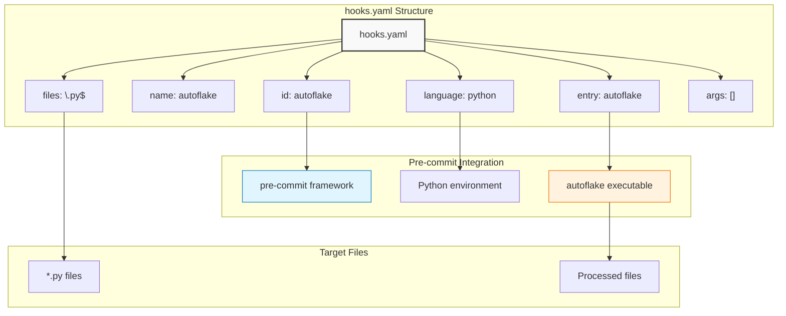
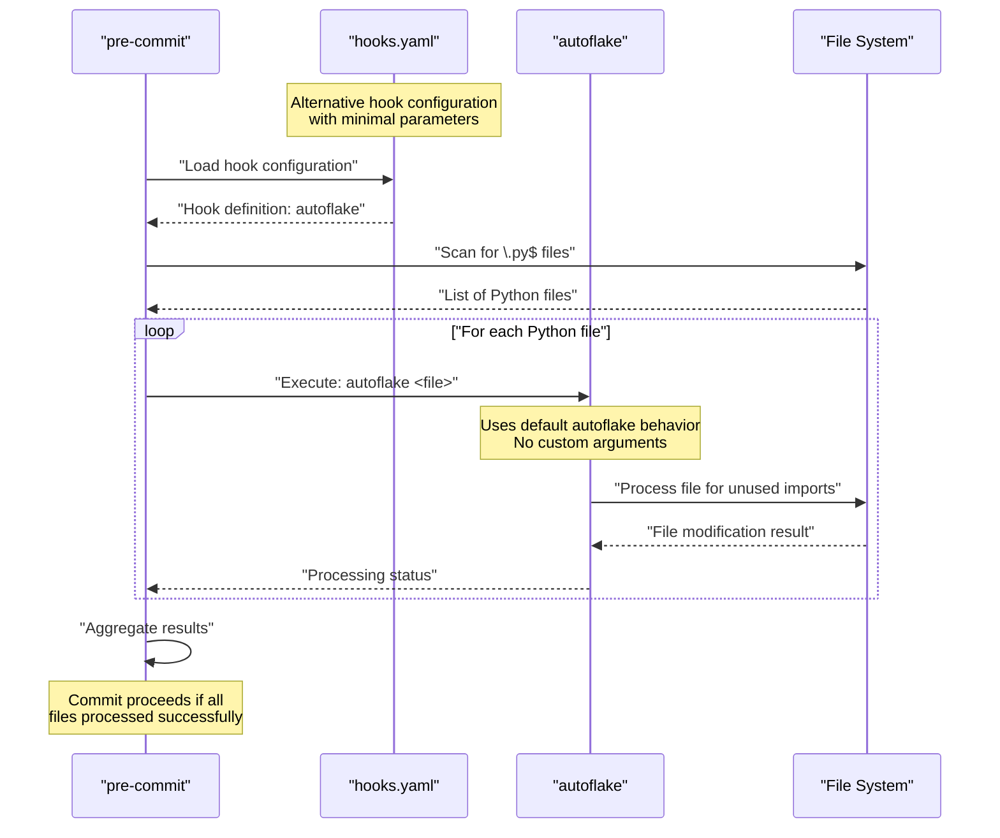
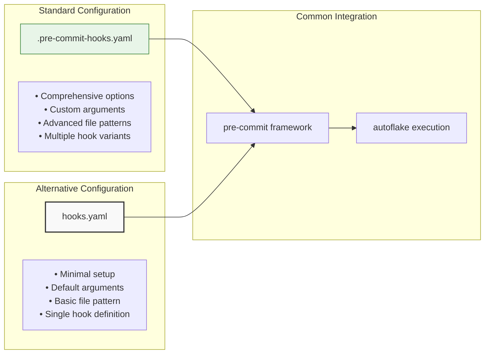

# Alternative Hook Configuration

Relevant source files

The following files were used as context for generating this wiki page:

- [hooks.yaml](hooks.yaml)

## Purpose and Scope

This document covers the alternative hook configuration system provided through the `hooks.yaml` file, which offers a simplified approach to integrating autoflake with pre-commit workflows. This configuration serves as an alternative to the standard pre-commit hook definition documented in [Standard Hook Configuration](#3.1).

For information about the core package system that enables this integration, see [Core Package System](#2). For installation and usage guidance, see [Installation and Usage](#4).

## Overview of Alternative Configuration

The `hooks.yaml` file provides a streamlined hook configuration that defines how the autoflake tool should be executed within pre-commit workflows. Unlike the standard configuration, this alternative approach offers a more minimal setup with basic defaults.

### Configuration Structure

The alternative hook configuration follows a simplified YAML structure that defines the essential parameters for autoflake execution:

**Configuration Structure Mapping**
- `hooks.yaml` file contains a single hook definition
- Each field maps directly to pre-commit framework parameters
- The configuration defines execution behavior and file targeting

Sources: [hooks.yaml:1-8]()

## Configuration Fields

### Hook Identification

The hook uses a standard identification pattern with minimal configuration:

| Field | Value | Purpose |
|-------|-------|---------|
| `id` | `autoflake` | Unique identifier for the hook within pre-commit |
| `name` | `autoflake` | Display name shown during hook execution |

Sources: [hooks.yaml:1-2]()

### Execution Configuration

The execution parameters define how autoflake is invoked:

| Field | Value | Purpose |
|-------|-------|---------|
| `entry` | `autoflake` | Command entry point for executing autoflake |
| `language` | `python` | Specifies Python as the execution environment |
| `args` | `[]` | Empty argument list, using autoflake defaults |

The `entry` field [hooks.yaml:3]() specifies the direct command execution without additional parameters, relying on autoflake's default behavior.

Sources: [hooks.yaml:3-6]()

### File Targeting

The file selection mechanism uses pattern matching:

- `files: \.py$` [hooks.yaml:5]() - Targets Python files exclusively using regex pattern matching
- The pattern ensures only files with `.py` extension are processed by the hook

Sources: [hooks.yaml:5]()

## Hook Execution Flow

**Hook Execution Process**
1. Pre-commit framework loads `hooks.yaml` configuration
2. File system scan identifies `.py` files matching the pattern
3. Autoflake executes with default parameters for each file
4. Results are aggregated to determine commit success

Sources: [hooks.yaml:1-8]()

## Usage Scenarios

### When to Use Alternative Configuration

The `hooks.yaml` configuration is suitable for:

- **Simple Integration**: Projects requiring basic autoflake functionality without custom arguments
- **Default Behavior**: Workflows that rely on autoflake's built-in defaults
- **Minimal Setup**: Environments where configuration simplicity is prioritized

### Configuration Comparison

**Key Differences**
- **Complexity**: Alternative configuration provides minimal options vs. comprehensive standard configuration
- **Flexibility**: Standard configuration supports custom arguments and multiple variants
- **Maintenance**: Alternative configuration requires less maintenance due to simpler structure

Sources: [hooks.yaml:1-8]()

## Integration Patterns

### Repository Integration

The alternative hook configuration integrates into development workflows through standard pre-commit mechanisms:

1. **Configuration Discovery**: Pre-commit framework locates `hooks.yaml` in the repository
2. **Hook Registration**: The `autoflake` hook becomes available for use
3. **Execution Context**: Python environment provides autoflake executable access
4. **File Processing**: Regex pattern `\.py$` ensures appropriate file targeting

### Environment Requirements

The configuration assumes:
- Python environment with autoflake available
- Pre-commit framework installation
- Repository with Python files to process

Sources: [hooks.yaml:1-8]()
