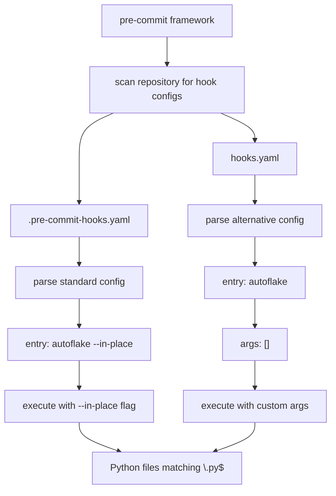
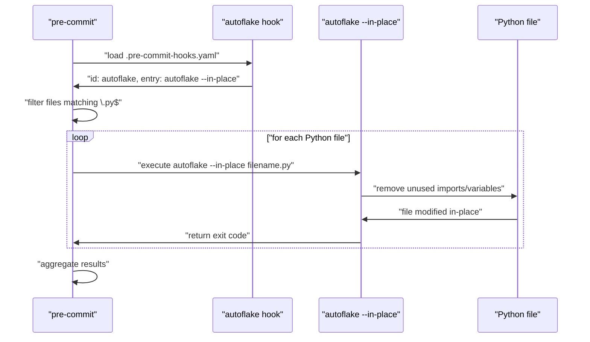
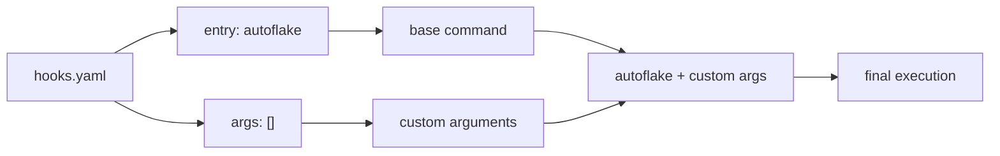
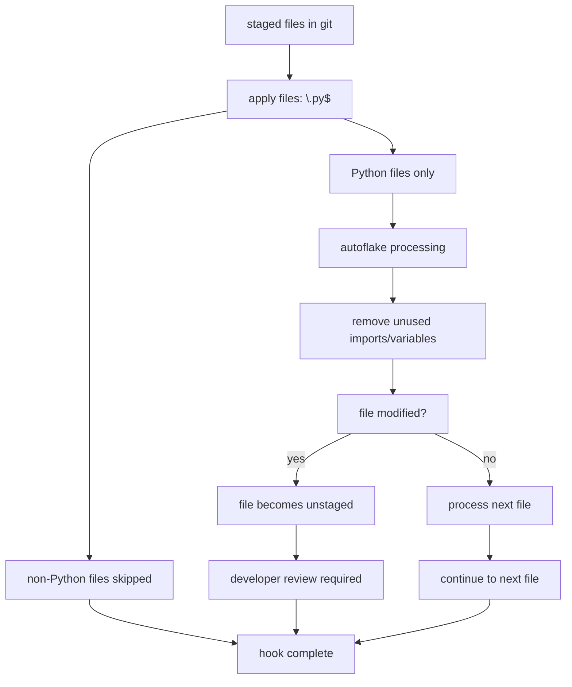

# Pre-commit Hook Integration

Relevant source files

The following files were used as context for generating this wiki page:

- [.pre-commit-hooks.yaml](.pre-commit-hooks.yaml)
- [hooks.yaml](hooks.yaml)

This document covers the pre-commit framework integration mechanisms provided by the pre_commit_dummy_package. It details how the package exposes autoflake functionality through standardized hook configuration files that enable automated Python code cleanup in development workflows.

For package installation and dependency management, see [Package Configuration](#2.1). For version tracking across hook configurations, see [Version Management](#2.2).

## Hook Configuration Architecture

The package provides two distinct hook configuration approaches for integrating autoflake with the pre-commit framework. Both configurations target the same underlying autoflake tool but differ in their execution parameters and intended use cases.

### Hook Configuration Flow

Sources: [.pre-commit-hooks.yaml:1-6](), [hooks.yaml:1-8]()

## Standard Hook Configuration

The primary hook configuration is defined in `.pre-commit-hooks.yaml`, which provides the official pre-commit integration for autoflake. This configuration uses the standard pre-commit hook specification format.

### Configuration Structure

| Field | Value | Purpose |
|-------|--------|---------|
| `id` | `autoflake` | Unique identifier for the hook |
| `name` | `autoflake` | Display name in pre-commit output |
| `entry` | `autoflake --in-place` | Command executed by pre-commit |
| `language` | `python` | Runtime environment specification |
| `files` | `\.py$` | Regex pattern for target files |

The `entry` field specifies `autoflake --in-place` [.pre-commit-hooks.yaml:3](), which directly modifies Python files by removing unused imports and variables without creating backup files.

### Hook Execution Process

Sources: [.pre-commit-hooks.yaml:1-6]()

## Alternative Hook Configuration

The `hooks.yaml` file provides an alternative configuration approach with different execution parameters. This configuration separates the base command from arguments, allowing for more flexible parameter customization.

### Configuration Differences

| Configuration File | Entry Point | Arguments | In-place Modification |
|-------------------|-------------|-----------|---------------------|
| `.pre-commit-hooks.yaml` | `autoflake --in-place` | N/A | Always enabled |
| `hooks.yaml` | `autoflake` | `args: []` | Configurable via args |

The alternative configuration uses `entry: autoflake` [hooks.yaml:3]() without the `--in-place` flag, requiring explicit argument specification through the `args` field [hooks.yaml:6]().

### Argument Customization Pattern

Sources: [hooks.yaml:1-8]()

## File Pattern Matching

Both configurations use identical file filtering patterns to target Python source files exclusively.

### Pattern Specification

The `files` field in both configurations specifies `\.py$` [.pre-commit-hooks.yaml:5](), [hooks.yaml:5](), which matches:

- Files ending with `.py` extension
- Uses regex anchoring with `$` to ensure exact suffix matching
- Escapes the dot character with `\.` for literal matching

### File Processing Workflow

Sources: [.pre-commit-hooks.yaml:5](), [hooks.yaml:5]()

## Language Runtime Configuration

Both hook configurations specify `language: python` [.pre-commit-hooks.yaml:4](), [hooks.yaml:4](), which instructs the pre-commit framework to:

1. Create an isolated Python environment for hook execution
2. Install the package and its dependencies (including `autoflake==1.4`)
3. Execute the hook entry point within this environment
4. Manage environment lifecycle and cleanup

This ensures consistent autoflake behavior across different development environments and prevents conflicts with system-wide Python packages.

Sources: [.pre-commit-hooks.yaml:4](), [hooks.yaml:4]()
