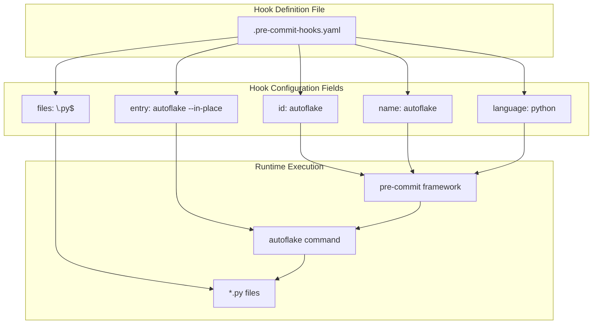
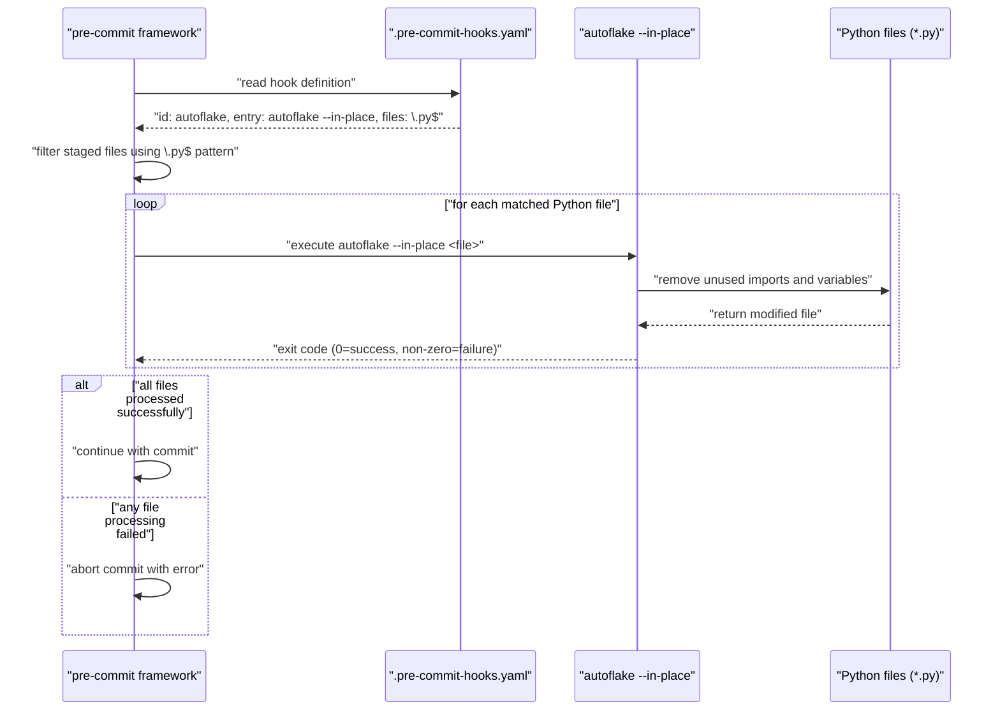
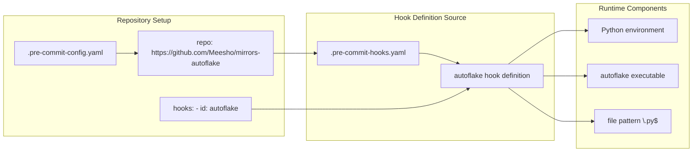

# Standard Hook Configuration

Relevant source files

The following files were used as context for generating this wiki page:

- [.pre-commit-hooks.yaml](.pre-commit-hooks.yaml)

## Purpose and Scope

This document covers the `.pre-commit-hooks.yaml` file, which provides the official hook definition for integrating autoflake with the pre-commit framework. This configuration file defines how the autoflake tool should be executed automatically during git commits to remove unused imports and variables from Python files.

For information about alternative hook configurations, see [Alternative Hook Configuration](#3.2). For details about the underlying package structure that supports this hook, see [Package Configuration](#2.1).

## Hook Definition Overview

The `.pre-commit-hooks.yaml` file contains a single hook definition that configures autoflake execution within the pre-commit framework. This YAML file follows the standard pre-commit hook specification format and serves as the primary integration point between the pre_commit_dummy_package and the pre-commit ecosystem.

**Hook Configuration Structure**

Sources: [.pre-commit-hooks.yaml:1-6]()

## Configuration Fields

The hook definition in `.pre-commit-hooks.yaml` consists of five key configuration fields that determine how autoflake integrates with the pre-commit framework:

| Field | Value | Purpose |
|-------|-------|---------|
| `id` | `autoflake` | Unique identifier for referencing this hook in `.pre-commit-config.yaml` files |
| `name` | `autoflake` | Display name shown during hook execution |
| `entry` | `autoflake --in-place` | Command executed by the hook with in-place file modification |
| `language` | `python` | Specifies Python environment requirement for hook execution |
| `files` | `\.py$` | Regular expression pattern matching Python files only |

### Hook Identifier and Naming

The `id` field [.pre-commit-hooks.yaml:1]() provides the unique identifier `autoflake` that users reference in their repository's `.pre-commit-config.yaml` configuration. The `name` field [.pre-commit-hooks.yaml:2]() specifies the display name shown in pre-commit output during execution.

### Command Entry Point

The `entry` field [.pre-commit-hooks.yaml:3]() defines the exact command executed: `autoflake --in-place`. The `--in-place` flag ensures that autoflake modifies files directly rather than outputting changes to stdout, which is essential for the pre-commit workflow where file modifications must be persisted.

### Language and File Targeting

The `language` field [.pre-commit-hooks.yaml:4]() specifies `python`, indicating this hook requires a Python environment. The `files` field [.pre-commit-hooks.yaml:5]() uses the regular expression `\.py$` to target only files ending in `.py`, ensuring the hook processes Python source files exclusively.

Sources: [.pre-commit-hooks.yaml:1-6]()

## Execution Workflow

The hook configuration enables a streamlined execution workflow where pre-commit automatically processes Python files using autoflake based on the defined parameters.

**Pre-commit Hook Execution Flow**

Sources: [.pre-commit-hooks.yaml:1-6]()

## Integration with Pre-commit Framework

The hook configuration establishes a standardized integration pattern that allows the pre_commit_dummy_package to seamlessly integrate with existing pre-commit workflows.

**Hook Registration and Discovery**

The pre-commit framework discovers the hook definition through the `.pre-commit-hooks.yaml` file when users configure their repositories to use this package. The `language: python` specification [.pre-commit-hooks.yaml:4]() ensures the framework sets up an appropriate Python environment, while the `files: \.py$` pattern [.pre-commit-hooks.yaml:5]() automatically filters the file set to Python sources only.

Sources: [.pre-commit-hooks.yaml:1-6]()

## Hook Behavior and Characteristics

The hook configuration defines specific behavioral characteristics that determine how autoflake processes files during pre-commit execution:

- **In-place modification**: The `--in-place` flag ensures files are modified directly rather than requiring output redirection
- **Python-only targeting**: The regex pattern `\.py$` restricts processing to Python source files
- **Automatic unused import removal**: Leverages autoflake's default behavior to remove unused imports and variables
- **Commit integration**: Processes only staged files, allowing selective commit workflows

The hook operates as a file transformer that runs automatically before each commit, ensuring code cleanup occurs consistently across the development workflow without requiring manual intervention.

Sources: [.pre-commit-hooks.yaml:1-6]()
